# (C# 코딩) 버거 키오스크
## 개요
- C# 프로그래밍 학습
- 1줄 소개: 사용자로부터 버거 주문을 받아 주문 내역과 총 금액을 계산하여 출력하는 간단한 버거 키오스크 프로그램
 
- 사용한 플랫폼: 
- C#, .NET Windows Forms, Visual Studio, GitHub
 
- 사용한 컨트롤:
- RadioButton, CheckBox, TextBox, Button, Label
 
- 사용한 기술과 구현한 기능:
- Visual Studio를 사용하여 Windows Forms 애플리케이션 개발
- 버거 메뉴와 추가 메뉴를 선택할 수 있는 인터페이스 구현
- 사용자가 선택한 메뉴에 따라 주문 내역과 총 금액을 계산하여 출력하는 기능 구현

## 1단계 실행 화면
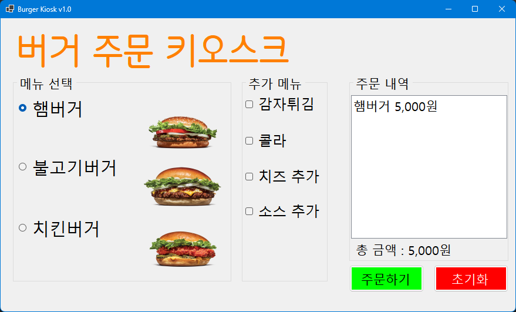

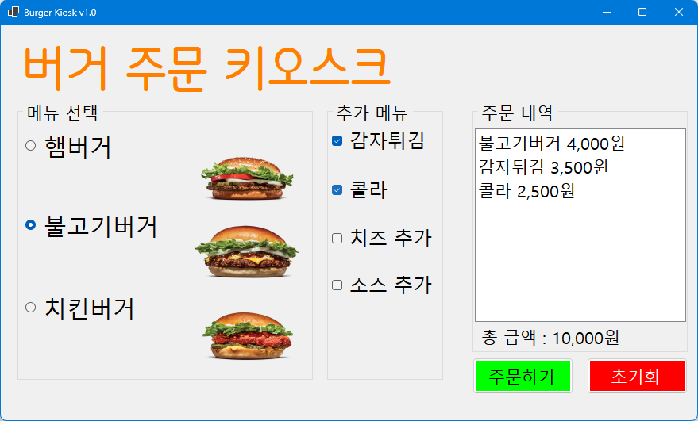

-구현한 내용
- 버거 메뉴와 추가 메뉴를 선택할 수 있는 인터페이스 구현
- 사용자가 선택한 메뉴에 따라 주문 내역과 총 금액을 계산하여 출력하는 기능 구현
- 버거 메뉴는 라디오 버튼으로 선택할 수 있도록 구현
- 추가 메뉴는 체크박스로 선택할 수 있도록 구현
- 주문 내역과 총 금액은 텍스트 박스에 출력되도록 구현
- 초기화 버튼으로 전체 초기화 가능

## 2단계 실행 화면

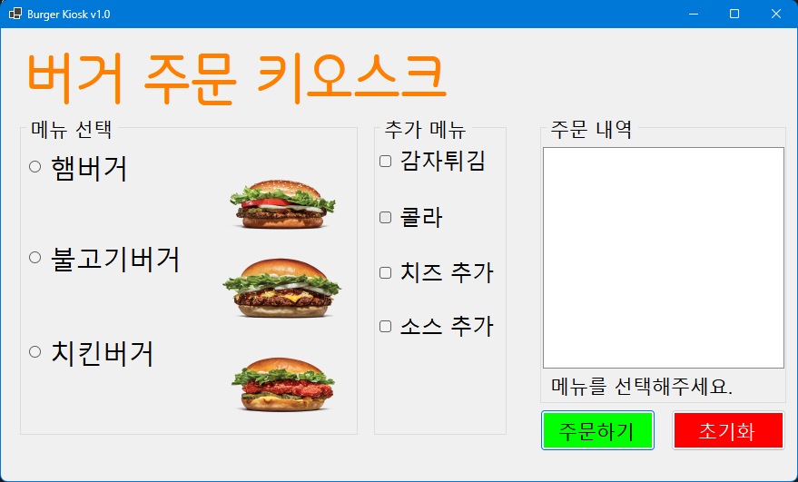
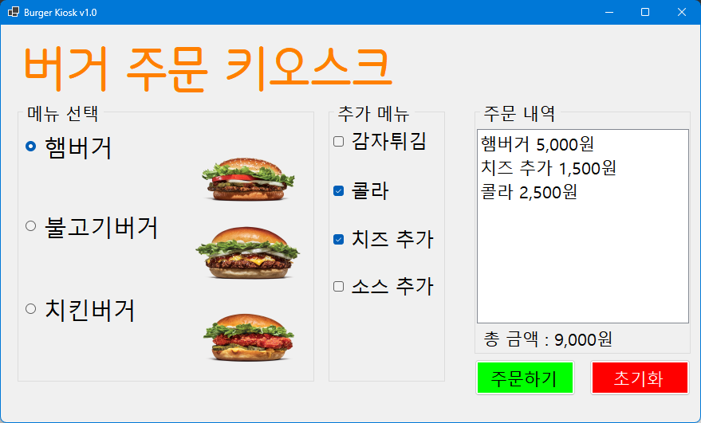
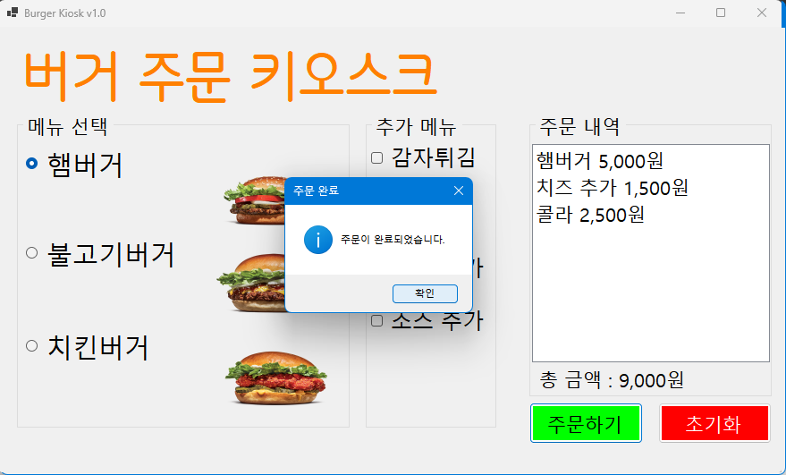

-구현한 내용
- 초기화면에서 아무것도 선택되지 않도록 변경
- 아무것도 선택하지 않은 상태에서 주문하기 버튼을 누르면 "메뉴를 선택해주세요"라는 메시지 박스가 나타나도록 구현
- 메뉴 선택 후 주문하기 버튼을 누르면 주문이 완료되도록 하는 기능 구현

## 3단계 실행 화면
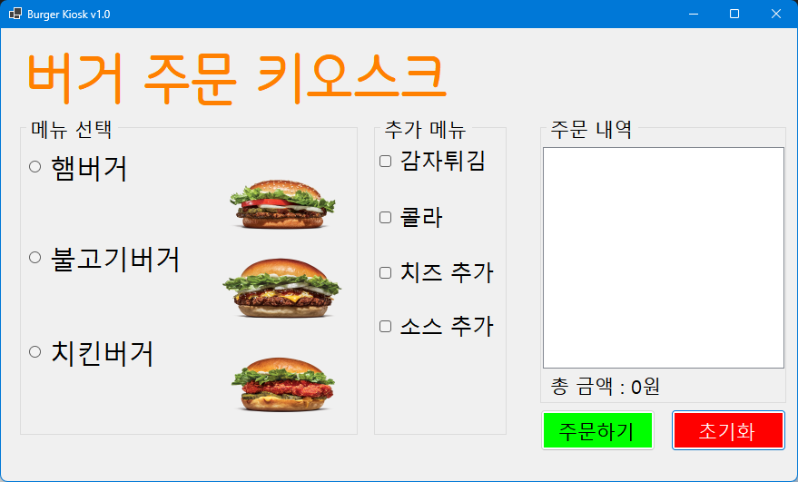
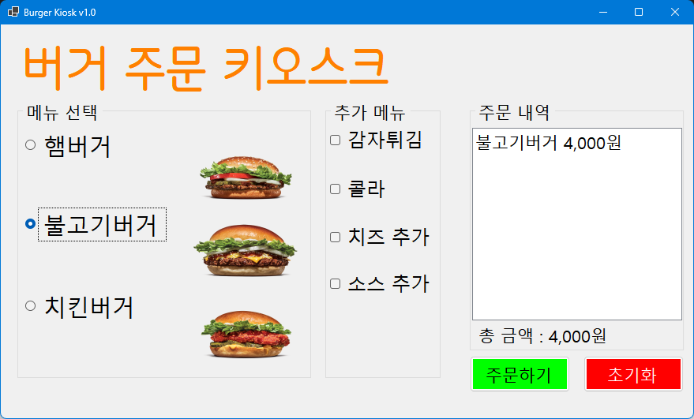
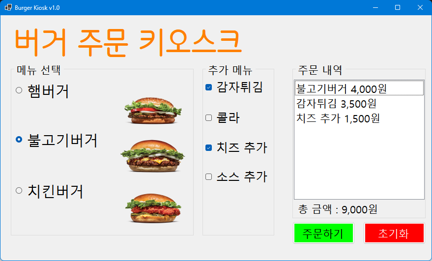
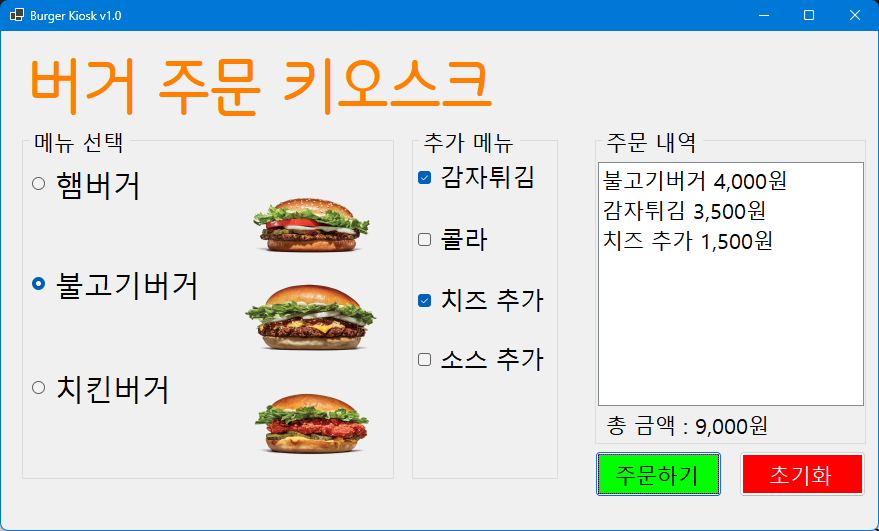
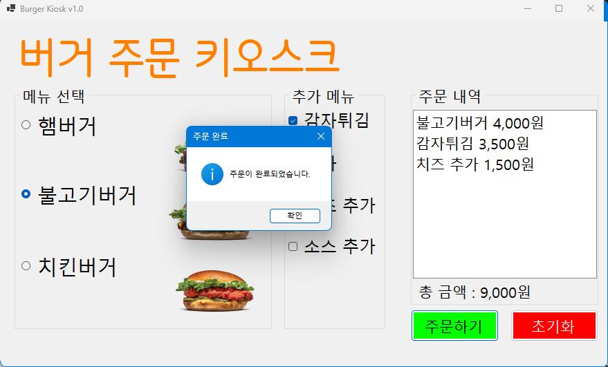

-구현한 내용
- 키보드의 방향키와 스페이스바로 메뉴를 선택하고 이동하는 기능 구현
- Enter 키를 이용하여 주문하기, 초기화 버튼을 누를 수 있도록 구현

## 4단계 실행 화면

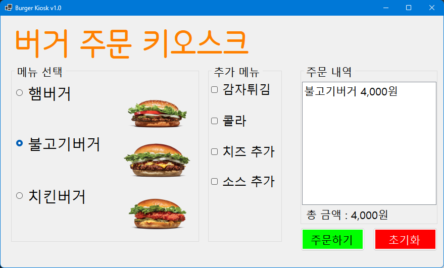

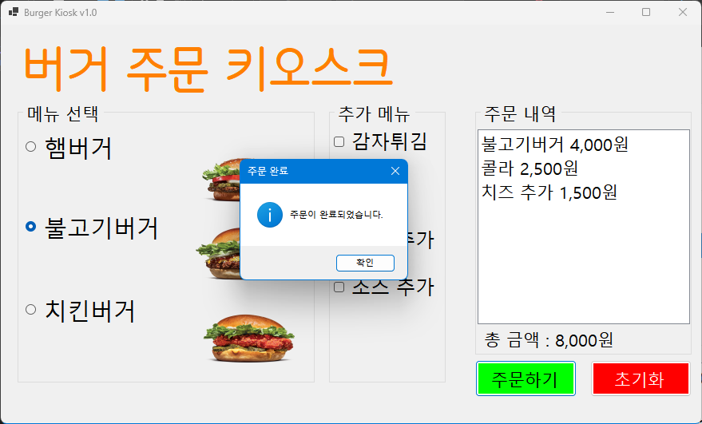

-구현한 내용
- 주문 내역을 실시간으로 리스트 박스에 업데이트하는 기능 추가
- 총 금액을 실시간으로 계산하는 기능 추가
- 주문하기 버튼으로 주문하는 기능 추가